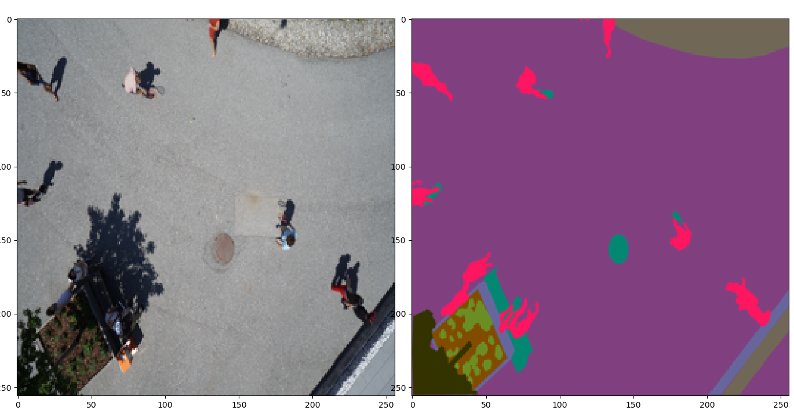

<h1>
 Unet-for-Semantic-Segmentation of Aerial Images
</h1>

In this repository I make a project on segmentation using Convolutional Neural Network architecture called U-Net
 architecture on aerial imagery dataset captured by drone.

<h3>
Content
<li style="color:#0B9170">
<ul style="color:#0B9170">
Semantic Segmentation
</ul>
</li>

<li style="color:#0B9170">

<ul style="color:#0B9170">
U-Net Architecture
</ul>
</li>
<li style="color:#0B9170">

<ul style="color:#0B9170">
Data Preprocessing
</ul>
<li style="color:#0B9170">

<ul style="color:#0B9170">
Semantic Segmentation using U-Net from Scratch
</ul>
</li>

</h3>
<h4>Semantic Segmentation</h4>
Image segmentation is the task of partitioning an image into multiple segments. This makes it a whole lot easier to analyze the given image. And essentially, isn’t that what we are always striving for in computer vision?
The below images perfectly illustrates the results of image segmentation

